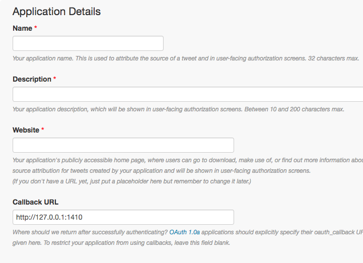
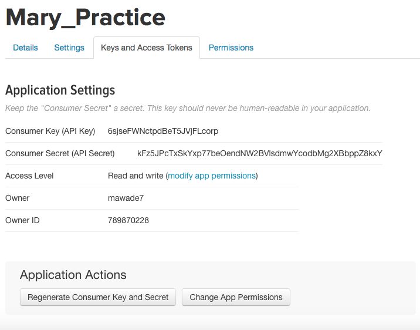
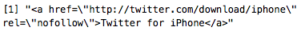
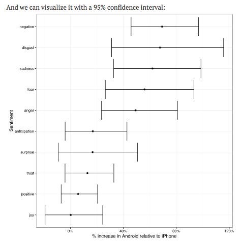

```{r setup, include=FALSE}
knitr::opts_chunk$set(echo = FALSE)
```

---

First, install and set the library for the following packages:

```{r, eval = FALSE, echo = TRUE}
install.packages("twitteR")
library(twitteR)
```


Now we can set up authentification for the Twitter API
```{r, eval=FALSE, echo=TRUE}
setup_twitter_oauth(getOption("twitter_consumer_key"),
                    getOption("twitter_consumer_secret"),
                    getOption("twitter_access_token"),
                    getOption("twitter_access_token_secret"))
```

---

Obtaining your access token and consumer key:

1. Create a Twitter account
2. Create a Twitter app at https://apps.twitter.com/

```{r, out.width = "500px"}

```

---

3\. Generate Access Token

```{r, out.width = "500px"}

```

If you need additional help, there is more information here: https://cran.r-project.org/web/packages/rtweet/vignettes/auth.html

___

We can download Twitter data from an individual user:

```{r, eval=FALSE, echo=TRUE}
library(dplyr)
library(purrr)

extracted_tweets <- userTimeline("username", n = num of tweets)
extracted_tweets_df <- tbl_df(map_df(extracted_tweets, as.data.frame))
extracted_tweets_df <- twListToDF(extracted_tweets)
```

You can download up to 3200 tweets at any one time.

---

Our example uses tweets from "realDonaldTrump"

```{r message=FALSE, warning=FALSE, include=FALSE, paged.print=FALSE}
library(twitteR)
library(purrr)
library(dplyr)
setup_twitter_oauth("6sjseFWNctpdBeT5JVjFLcorp",
                    "kFz5JPcTxSkYxp77beOendNW2BVlsdmwYcodbMg2XBbppZ8kxY",
                    "789870228-KQrMaR4KPxXW8aLBcy40ygFQaMyQ5vHY7RKbplEE",
                    "MdzxGgOEiwiIqm7v3qqsNACz2YJdKHIjEfmshPxYEpDrA")

trump_tweets <- userTimeline("realDonaldTrump", n = 3200)
trump_tweets_df <- tbl_df(map_df(trump_tweets, as.data.frame))
```

```{r eval=FALSE, echo=TRUE, message=FALSE, warning=FALSE, paged.print=FALSE}
trump_tweets <- userTimeline("realDonaldTrump", n = 3200)
trump_tweets_df <- tbl_df(map_df(trump_tweets, as.data.frame))
```

```{r eval=TRUE, echo=TRUE, message=FALSE, warning=FALSE}
names(trump_tweets_df)
```

___

###**Other fun commands from the TwitteR package**

Extract tweets that contain a certain word or phrase:

```{r eval=TRUE, echo=TRUE, message=FALSE, warning=FALSE}
maga <- searchTwitter("#MAGA", n=50, resultType = "popular")
maga_df <- twListToDF(maga)
names(maga_df)
```

---

###**Other fun commands from the TwitteR package**

Find information about a user:

```{r eval=TRUE, echo=TRUE, message=FALSE, warning=FALSE}
trump <- getUser('realDonaldTrump')
trump$getFollowersCount()
trump$getFriends(n=1)
```

```{r eval=FALSE, echo=TRUE, message=FALSE, warning=FALSE}
trump$getFavorites()
trump$getDescription()
trump$getProfileImageUrl()
```

___

###**Other fun commands from the TwitteR package**

Find what's trending in different locations:

```{r eval=TRUE, echo=TRUE, message=FALSE, warning=FALSE}
Montreal_trends <- getTrends(4118)
head(Montreal_trends$name)
closestTrendLocations(-42.8, -71.1)
```

___

David Robinson analyzes the difference between tweets that are posted from an iPhone versus an Android. So first, he cleans up the source data to separate the tweets by the two devices.

```{r eval=TRUE, echo=TRUE, message=FALSE, warning=FALSE, paged.print=TRUE}
library(tidyr)
tweets <- trump_tweets_df %>%
  select(id, statusSource, text, created) %>%
  extract(statusSource, "source", "Twitter for (.*?)<") %>%
  filter(source %in% c("iPhone", "Android"))
```


```{r, out.width = "500px"}

```


---

```{r eval=TRUE, echo=TRUE, message=FALSE, warning=FALSE}
head(tweets)
```


---

Next, he looks for differences in the times of day that the two devices are used to post:

```{r eval=FALSE, echo=TRUE, message=FALSE, warning=FALSE}
library(lubridate)
library(scales)
library(ggplot2)

tweets %>%
  count(source, hour = hour(with_tz(created, "EST"))) %>%
  mutate(percent = n / sum(n)) %>%
  ggplot(aes(hour, percent, color = source)) +
  geom_line() +
  scale_y_continuous(labels = percent_format()) +
  labs(x = "Hour of day (EST)",
       y = "% of tweets",
       color = "")
```


___


```{r eval=TRUE, echo=FALSE, message=FALSE, warning=FALSE, fig.align="center"}
library(lubridate)
library(scales)
library(ggplot2)

tweets %>%
  count(source, hour = hour(with_tz(created, "EST"))) %>%
  mutate(percent = n / sum(n)) %>%
  ggplot(aes(hour, percent, color = source)) +
  geom_line() +
  scale_y_continuous(labels = percent_format()) +
  labs(x = "Hour of day (EST)",
       y = "% of tweets",
       color = "")
```

___

He also does some sentiment analysis. First he separates the tweets out into words using the unnest_tokens() command from the tidytext library.

```{r eval=TRUE, echo=TRUE, message=FALSE, warning=FALSE}
library(tidytext)
library(stringr)

reg <- "([^A-Za-z\\d#@']|'(?![A-Za-z\\d#@]))"
tweet_words <- tweets %>%
  filter(!str_detect(text, '^"')) %>%
  mutate(text = str_replace_all(text,
            "https://t.co/[A-Za-z\\d]+|&amp;", "")) %>%
  unnest_tokens(word, text, token = "regex", pattern = reg) %>%
  filter(!word %in% stop_words$word,
         str_detect(word, "[a-z]"))
```

---

```{r eval=TRUE, echo=TRUE, message=FALSE, warning=FALSE}
head(tweet_words)
```


---

We can use the sentiment data set from the tidytext library to sort the words by sentiment. 

```{r eval=TRUE, echo=TRUE, message=FALSE, warning=FALSE}
sentiments
```


___

David Robinson uses the NRC Word-Emotion Association, which sorts words into 10 sentiments: positive, negative, anger, anticipation, disgust, fear, joy, sadness, surprise, and trust.

```{r eval=TRUE, echo=TRUE, message=FALSE, warning=FALSE}
nrc <- sentiments %>%
  filter(lexicon == "nrc") %>%
  dplyr::select(word, sentiment)

head(nrc)
```

___

Then he joins this with the tweet_words data frame to analyze the sentiment of the words in the tweets by source.

```{r eval=TRUE, echo=TRUE, message=FALSE, warning=FALSE}
library(tidyverse)

sources <- tweet_words %>%
  group_by(source) %>%
  mutate(total_words = n()) %>%
  ungroup() %>%
  distinct(id, source, total_words)
```

---

```{r eval=TRUE, echo=TRUE, message=FALSE, warning=FALSE}
by_source_sentiment <- tweet_words %>%
  inner_join(nrc, by = "word") %>%
  count(sentiment, id) %>%
  ungroup() %>%
  complete(sentiment, id, fill = list(n = 0)) %>%
  inner_join(sources) %>%
  group_by(source, sentiment, total_words) %>%
  summarize(words = sum(n)) %>%
  ungroup()
```


___

```{r echo=TRUE, message=FALSE, warning=FALSE}
head(by_source_sentiment)
```


---

```{r, out.width = "550px", fig.align="center"}

```


<!-- If you don't have access through the Twitter API, you can download the data that David Robinson uses directly: -->

<!-- ```{r, eval=FALSE, echo=TRUE} -->
<!--  load(url("http://varianceexplained.org/files/trump_tweets_df.rda")) -->
<!-- ``` -->


